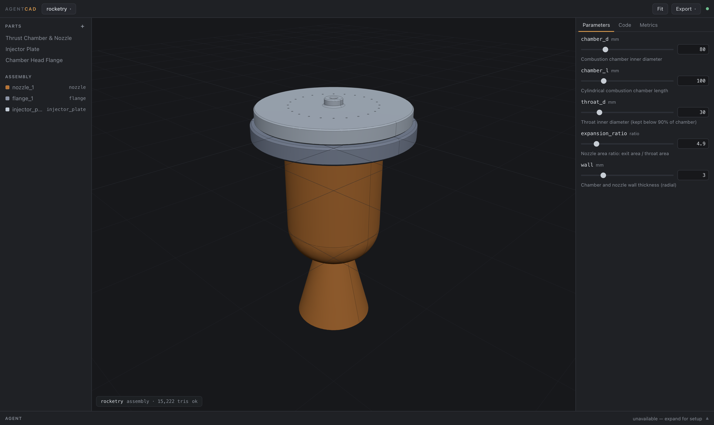

# AgentCAD

**Agentic-first parametric CAD for complex parts and systems** — rocketry,
construction, prototyping. Real B-rep solid modeling (OpenCascade via
[build123d](https://build123d.readthedocs.io)), a browser UI, and AI agents
as first-class users. Runs on macOS today; the architecture is
Windows/Linux-ready.



## Why agentic-first

Traditional CAD encodes design intent in click-history feature trees that
only the authoring application can interpret. AgentCAD makes the opposite
bet: **the model is code**. Every part is a small parametric Python script —
the representation language models read, write, diff, and review best.
Humans steer and review; agents author and iterate.

The second bet: **the kernel is the referee**. Every change an agent makes is
validated by real geometry — B-rep validity, volume, mass, bounding box,
interference between assembly components — and every failure returns as
structured data (traceback, failing line, hints), so agents self-correct in a
tight loop instead of hallucinating geometry.

The full tool surface is defined once and exposed twice: as an **MCP server**
for any MCP client (Claude Code, Claude Desktop, ...) and as a **built-in
chat agent** in the UI. The browser UI, the chat agent, and external agents
are peers — same service, same events, same files.

## Quickstart

Prerequisites: macOS, [uv](https://docs.astral.sh/uv/), Python 3.12
(uv will fetch it if missing).

```bash
make setup     # uv sync — installs build123d/OCCT (~2 GB of wheels, one time)
make run       # starts the server and opens the UI at http://127.0.0.1:8630
```

Three example projects are bundled and appear in the project switcher:

- **rocketry** — a liquid-engine thrust chamber (nozzle, injector plate, flange)
- **construction** — a steel truss gusset node with bolt patterns
- **prototyping** — a snap-fit electronics enclosure

Other useful targets: `make test` (full suite), `make app` (builds
`dist/AgentCAD.app`), `make serve` (headless).

## Drive it from Claude Code

```bash
claude mcp add agentcad -- uv --directory /path/to/cad_claude run agentcad mcp
```

Then ask for parts in natural language — "open the rocketry example and
increase the nozzle expansion ratio until the exit diameter reaches 120 mm,
then export STEP". The MCP server proxies the running app (and auto-starts it
if needed), so the UI updates live while the agent works. See
[docs/agent-api.md](docs/agent-api.md) for the tool reference.

## Built-in chat agent

Set `ANTHROPIC_API_KEY` in the environment before `make run` and the Agent
panel in the UI becomes a full tool-using assistant with the same tool
surface. Without a key, the panel explains the MCP alternative and everything
else works normally.

## Writing parts

A part is a plain build123d script defining `PARAMS` (numeric specs with
bounds and units) and `build(p)` returning a solid. The contract, common
idioms, and OCCT failure modes are in
[docs/part-authoring.md](docs/part-authoring.md) — or ask an agent to call
the `part_template` tool.

```python
from build123d import *

PARAMS = {"width": {"default": 80.0, "min": 10.0, "max": 300.0,
                    "unit": "mm", "description": "Plate width"}}

def build(p):
    with BuildPart() as part:
        Box(p.width, 60, 8)
        Hole(radius=6)
    return part.part
```

## Documentation

- [docs/architecture.md](docs/architecture.md) — processes, components, data flow
- [docs/agent-api.md](docs/agent-api.md) — the 17-tool agent surface, MCP setup
- [docs/part-authoring.md](docs/part-authoring.md) — the script contract
- [docs/user-guide.md](docs/user-guide.md) — the UI, surface by surface
- [docs/roadmap.md](docs/roadmap.md) — Windows/Linux, mates, drawings, sandboxing

## Trust model

AgentCAD is a local, single-user tool. Part scripts are Python and run with
your privileges in an isolated kernel subprocess — review what agents write,
the same way you review the code they write anywhere else. The server binds
`127.0.0.1` only; kernel requests time out and the worker auto-respawns; the
API key is read from the environment and never stored. Details in
[docs/architecture.md](docs/architecture.md#trust-model).

## Project layout

```
agentcad/          Python package: kernel worker/client, core service,
                   FastAPI server, MCP + chat agents, CLI
frontend/          Static browser UI (ES modules + vendored Three.js)
examples/          Three real parametric example projects
docs/              Documentation (+ design spec and implementation plan)
tests/             pytest suite (kernel, store, service, API, MCP, examples)
```

Projects you create live in `~/AgentCAD/projects/` by default
(`--projects-dir` overrides).
